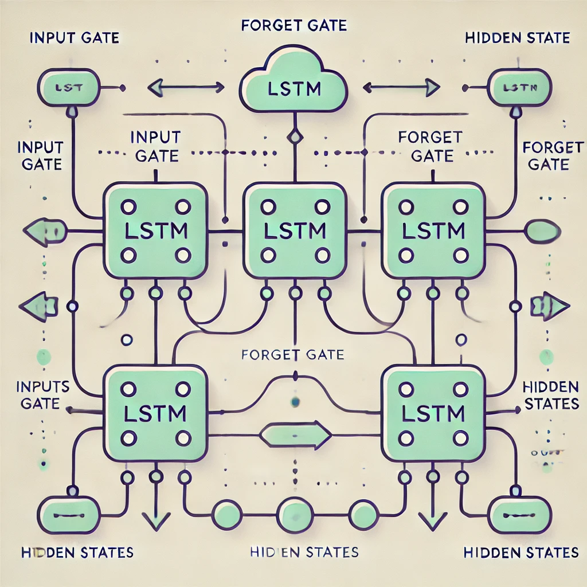
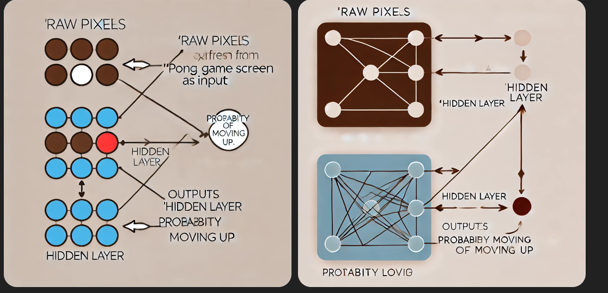
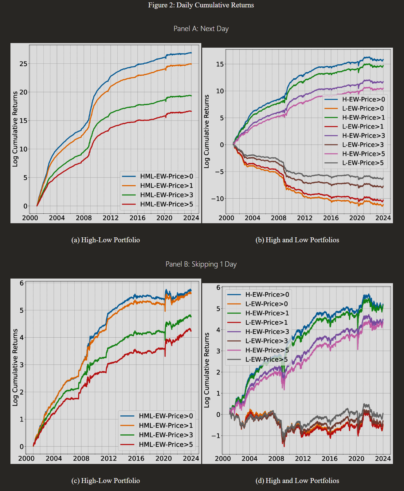
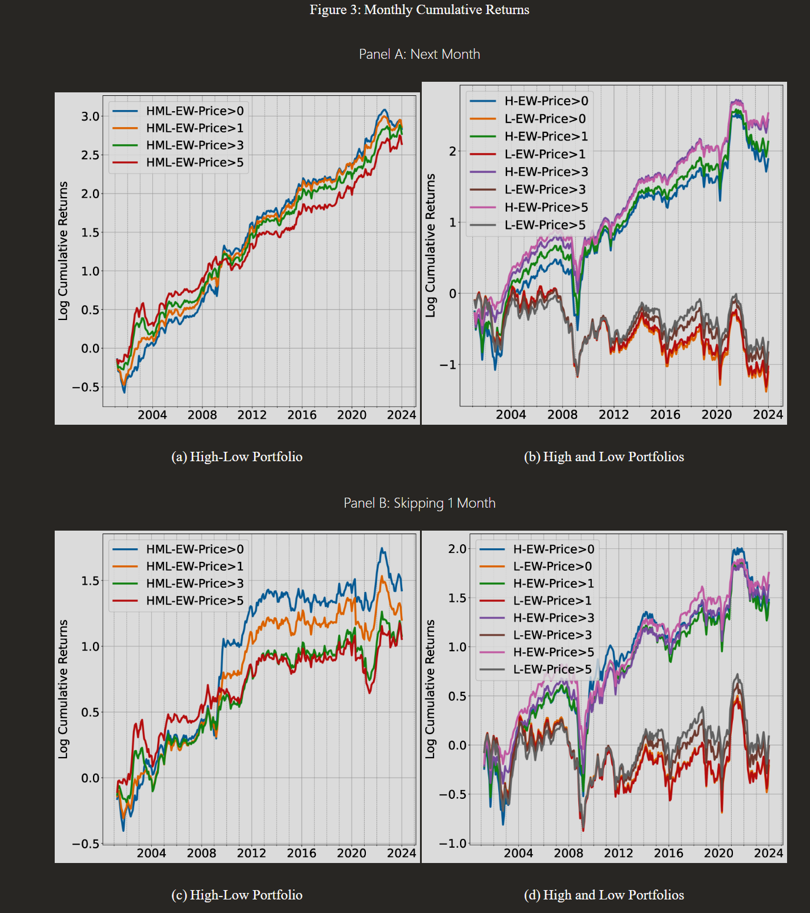

# Stock-Price-Prediction-Using-AI
In this project, we will employ cutting-edge generative AI algorithms and machine learning models to analyze historical stock market data and generate predictions for future price movements.
By training these models on vast amounts of historical data, we can identify patterns, trends, and correlations that may not be apparent to human analysts.
The project will involve preprocessing and cleaning the historical stock data, training generative AI models such as Generative Adversarial Networks (GANs) or Variational Autoencoders (VAEs), 
and evaluating the performance of these models using appropriate metrics. Additionally, we will explore techniques for enhancing the robustness and accuracy of the predictions, such as ensemble learning or transfer learning.
Ultimately, the goal of this project is to develop a reliable and effective system for predicting stock prices using state-of-the-art generative AI techniques.

Long Short-Term Memory networks, commonly referred to as LSTMs, are a specialized type of Recurrent Neural Network (RNN) designed to effectively capture and learn long-term dependencies in sequential data. Originally introduced by Hochreiter and Schmidhuber in 1997, LSTMs have since been improved and popularized through extensive research. Their architecture is particularly well-suited for addressing the vanishing gradient problem, which often hinders traditional RNNs. Due to their ability to retain and utilize information over extended sequences, LSTMs have become a powerful tool across a wide range of applications, including time series forecasting, language modeling, and speech recognition.

 

All recurrent neural networks (RNNs) are structured as chains of repeating modules, where each module processes sequential data in a step-by-step manner. In standard RNNs, these repeating modules have a straightforward architecture, typically consisting of a single activation layer like a tanh layer.

Long Short-Term Memory networks (LSTMs), while sharing the chain-like structure of RNNs, are significantly more sophisticated. Instead of a single neural network layer, the repeating module in an LSTM is composed of four layers that work together in a unique and highly coordinated manner. This intricate design allows LSTMs to selectively retain or forget information over long sequences, making them far better suited for capturing long-term dependencies in data.

**Stock Market Agent Using Evolution Strategy (ES)**

An Evolution Strategy (ES) Agent offers a simple yet powerful algorithm for exploring complex environments, including financial markets. Though its name might sound advanced, the core idea is surprisingly intuitive. It leverages random exploration and optimization to train a neural network to perform actions effectively in its environment.

**Understanding the ES Agent**

At its core, an ES agent is a neural network that maps inputs to outputs:

* Inputs: The agent receives stock market data, such as prices, volumes, and technical indicators.
* Outputs: It predicts the probability of possible actions, such as:
  * Buy: Initiating a position in the stock.
  * Sell: Closing a position.
  * Hold: Taking no action.

The agent aims to maximize rewards (e.g., portfolio returns) by learning which actions lead to profitable outcomes.

**How It Works**

1. Initialize the Neural Network:

   * The neural network begins with random weights, enabling the agent to take random actions.
   * These actions are exploratory and help the agent understand the "landscape" of the environment.
   
2. Environment Interaction:

   * The agent interacts with the stock market simulator, taking actions (buy/sell/hold) based on its predictions.
   * For each action, it receives a reward (profit/loss) based on market movements.

3. Noise Injection:

   * ES involves adding random noise to the neural network's weights, creating a population of slightly varied agents.
   * Each agent explores the environment using its modified policy.
   
4. Performance Evaluation:
   * The rewards achieved by each agent are recorded.
   * Agents with higher rewards are deemed more successful.
   
5. Weight Update:

   * The algorithm aggregates the noise that led to higher rewards and updates the base neural network's weights accordingly.
   * This moves the agent closer to an optimal strategy over time.

6. Repeat:
   * The process of injecting noise, interacting with the environment, and updating weights is repeated for multiple iterations, gradually improving the agent's performance

In reinforcement learning, the primary objective is to optimize the parameters (weights and biases) of the neural network to maximize the agent's performance in its environment. These parameters determine how the agent processes inputs, makes decisions, and selects actions. By improving these parameters, the agent learns strategies that lead to higher rewards and, ultimately, more consistent success in achieving its goals. This process involves iterative exploration, evaluation, and adjustment, allowing the agent to refine its behavior over time.

**Requirements**

Tensorflow (https://pypi.org/project/tensorflow/) 
Python 3.6.2 (https://www.python.org/downloads/release/python-362/) 
Pandas (https://pypi.org/project/pandas/) 
Numpy (https://pypi.org/project/numpy/) 
Keras (https://pypi.org/project/Keras/) 
Seaborn (https://pypi.org/project/seaborn/) 
Yahoo-Finance (https://pypi.org/project/yahoo-finance/) 
Matplotlib (https://pypi.org/project/matplotlib/) 

